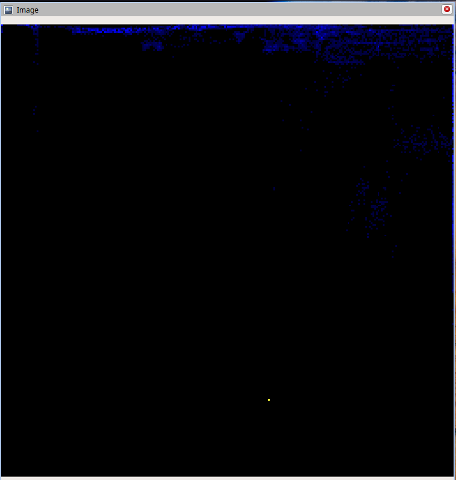
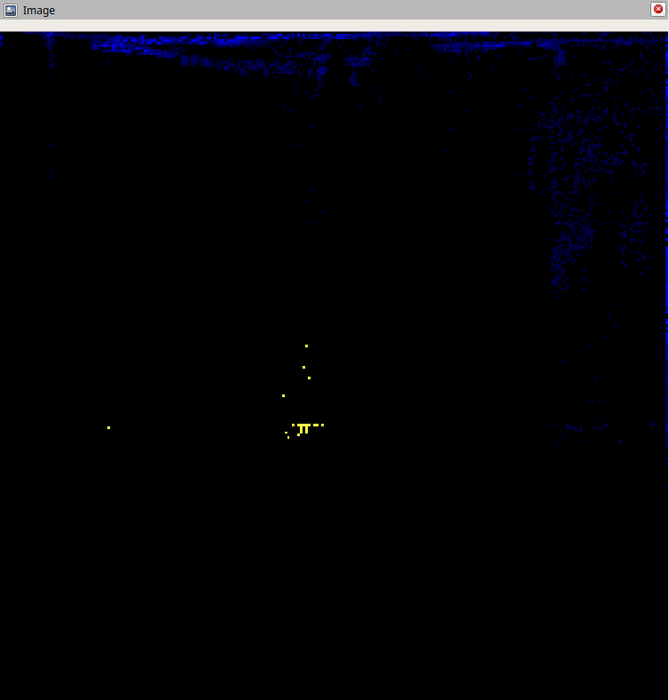

# Репозиторий команды "В поисках Немо"

## Описание

Этот репозиторий является решением квалификационного задания хакатона "StarLine Беспилотный 2025" команды "В поисках Немо".

## Описание решения

### Картографирование и SLAM

Для SLAM используется стандартный пакет `slam_toolbox`. Настройки SLAM находятся в файле `config/mapper_params_online_async.yaml`.

Для работы пакета облако точек преобразуется в лазерный скан с помощью модуля `pc2l`. Исходный код модуля находится в директории `src/pc2l`.

### Обнаружение маркеров

Для обнаружения маркеров используется модуль `marker_detector`. Исходный код модуля находится в директории `src/marker_detector`.

Маркеры обнаружаются за счет их отличающейся яркости. Для обычных точек (стены, пол) интенсивность отраженного сигнала падает с расстоянием, образуя достаточно предсказуемую зависимость. Точки маркера же, напротив, имеют особую сигнатуру: они расположены близко, но очень тусклые.

Экспериментально было выявлено что никакие другие объекты такой характеристикой не обладают

График яркости от расстояния до маркера в диапазоне 0-2м:




Тот же график с точками, принадлежащими маркеру (аномальные точки выделены желтым цветом):


При движении робота определяются эти аномальные точки и считается их центр масс, который принимается в качестве центра маркера.

### Видеозапись решения

<video controls src="movies/2025-09-03 13-21-35_full_mapping_and_marker_detection.mp4" title="Title"></video>

## Инструкция по запуску

Работа выполнена на Ubuntu 24.04 LTS с ROS2 Jazzy.

Для запуска:

```bash
git clone https://github.com/arsenier/in_search_of_the_nemo.git
cd in_search_of_the_nemo
colcon build
source install/setup.bash
make all # запускает pc2l, slam и detector
```

Также для визуализации можно запустить rviz:

```bash
make rviz
```

Вместе с этим следует запустить rosbag файл:

```bash
mkdir bag_files
cp <path_to_rosbag_file> bag_files/tb_office_v02_0.mcap
ros2 bag play bag_files/tb_office_v02_0.mcap
```
